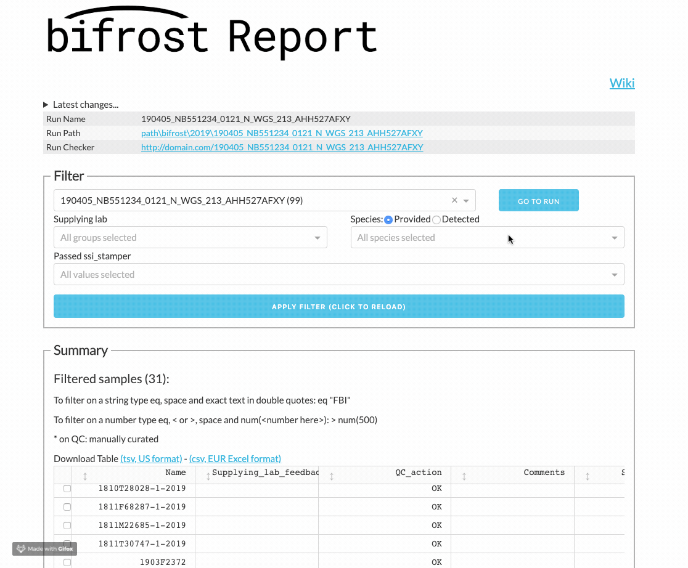
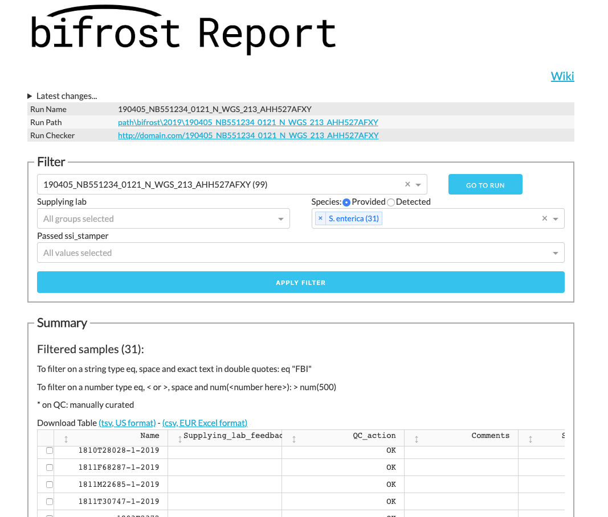
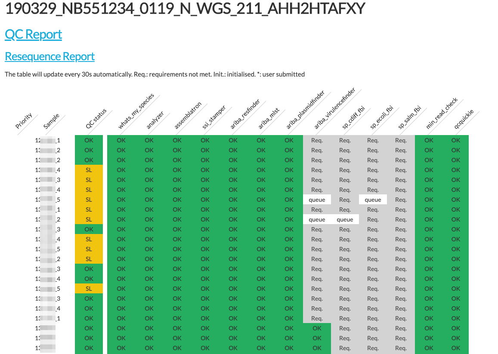

# bifrost

### User interface


### Filter


### Run plot


### Run status checker


## Installing bifrost

### Requirements

Python >=3.7

anaconda/miniconda >=4.3

MongoDB >=4.0.0

pip >= 9.0

### Setting up MongoDB

Get MongoDB (community edition) and set it up following their documentation. 
You'll need a database and read/write account for it.

https://www.mongodb.com/download-center/community

The system relies on a species collection containing species-specific information used for 
QC testing and species identification. 

Here is an example of an entry:

```
{
    "_id" : ___,
    "organism" : "E. coli",
    "group" : "Escherichia",
    "mlst_species" : "/path_to_db/ariba/mlst/Escherichia_coli_1/ref_db/",
    "ncbi_species" : "Escherichia coli",
    "min_length" : 4500000, #min and max genome size to pass QC
    "max_length" : 5800000
}
```

After this step you should have a mongodb instance running, a user and a species collection with the species you expect to find in the samples.

### Setting up the conda environment

Install the conda environment using envs/bifrost_for_install.yaml

### Installing bifrostlib

Install bifrostlib withing the conda environment:

```
source activate bifrost
pip install lib/bifrostlib/
```


### Adjusting config

Adjust the main config.yaml and the individual components config.yaml.

### Setting up the database key file location environment variable

Create a file named `keys.txt` with the mongodb URI including the database to use.

Create an environment variable with the mongodb key location.
```
export BIFROST_DB_KEY=/path/to/keys.txt
```

You can also set the key on the conda environment so it gets set when the environment is active.

https://conda.io/docs/user-guide/tasks/manage-environments.html#saving-environment-variables

## Running bifrost:

Activate conda environment `bifrost`:
```
source activate bifrost
```

Create output directory, and move into it 
```
mkdir run_name # Run name will be taken from the directory name or it can be set through config
cd run_name
```

Link the demultiplexed (fastq.gz) samples folder as samples (by default):
```
ln -s path/to/run samples
```

Copy/clone this directory in src directory:

```
git clone git@github.com:ssi-dk/bifrost.git
mv bifrost src
```

Run snakemake to generate the run command and the folder structures.

Set the components you want to run (component names are the filenames in /components dir), default is `qcquickie,assemblatron,analyzer,ssi_stamper`.

Use `use_mongodb=False` in config if you don't want to store the run, samples and results in the database.
For now however, you need to use the database to access the species table to run mlst.

Then start the program running:

```
snakemake -s src/bifrost.smk
```

You can change any option in config.yaml using the `--config` argument. Here is an example with some useful ones:

```
--config components=qcquickie,assemblatron,analyzer partition=project run_name=myrun assembly_with=spades
```

For more info on each parameter, check the sample config file.
